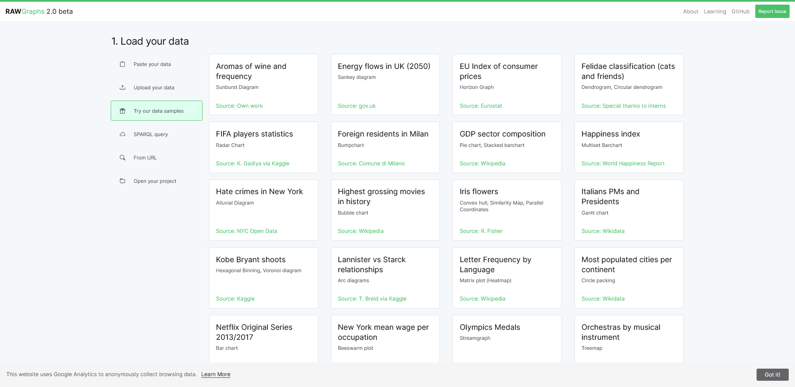
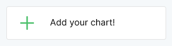
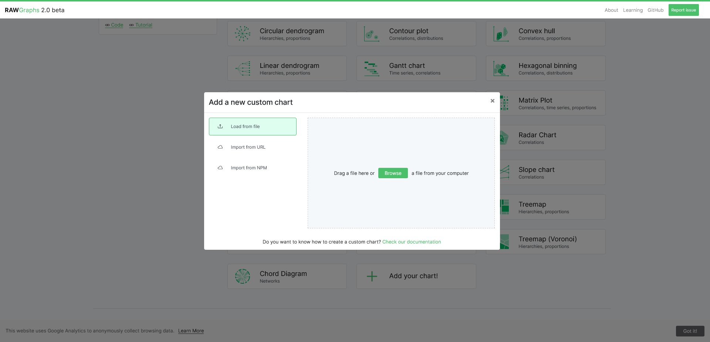

# IVIS - G1 - RAWGraphs custom charts
Aumüller Thomas, Heider Martin, Ramadan Abdelrahman

## How to make it run
First clone the git Repository:
```
git clone git@github.com:solidth/RAWGraphs-Custom-Charts.git
```
Browse the folder containing the repository:
```
cd rawgraphs-custom-charts
```
Install client-side dependencies:
```
npm install
```
You can now run the sandbox environment to test your charts:
```
npm run sandbox
```
After running the sandbox, you can look at the Live-Preview under:
```
localhost:9000
```

## Build and testing locally in RAWGraphs app (local dev. Server)
How to build and run a local development server for testing IVIS implementation.

Clone those two repositories and install their dependencies:
```
git clone https://github.com/blindguardian50/rawgraphs-charts.git
git clone https://github.com/blindguardian50/rawgraphs-app.git
```
Open a terminal in the cloned `\rawgraphs-charts` folder and create a build with the command:
```
nvm install 14

// if needed 
nvm use 14

yarn install
npm install
```
Then create a link with the command:
```
yarn link
```
Open a terminal in the cloned `\rawgraphs-app` folder:
```
yarn link "@rawgraphs/rawgraphs-charts"
```
After that the local development server should be ready to go and you can test it locally by starting the app:
```
npm run start
```
# Creating a Build
When you are satisfied with your project, you can build the js bundle to be used in the RAWGraphs interface.

In terminal navigate the folder in wich you cloned this template and run:
```
npm run build
```
This will generate a folder named lib in which you will find three files.

The one named `index.umd.js` is the bundle that can be loaded by RAWGraphs. This file can be renamed.

# Loading a Build
After you created a build and have the `index.umd.js` file or `<name>.umd.js` file you can go to your `development server`.
1. Load your data.
2. Click `Try our data samples`.



3. In `Choose a chart` go to `Add your chart!`.



4. Here drag or select your `index.umd.js` file or `<name>.umd.js` file.



---
## Problems with `npm run sandbox`
Commands that may fix some of the Node.js errors when trying to run `npm run sandbox`.
```
npm install dsv-loader --save-dev
npx browserslist@latest --update-db
```
## Problems with `npm run build`
react-scripts: not found
```
yarn install
npm install
```
### Changes to run Similarity Map in Sandbox
- added `src/similaritymap`.
- added `src/styles/base.raw.css`.
- added `src/index.html`: 
  - export { default as similaritymap } from './similaritymap'
- added `src/tsne.js`.
    - (for later <b>UMAP</b> und <b>PCA</b>)
- added `datasets/fake-multiset.tsv`.
- added `example/configurations/similaritymap-test.js`.
- added `example/configurations/similaritymap-test.js`:
  - import chart from `customcharts/similaritymap`


### What is `.rawgraphs`
JSON-based format that allows users to save and later reload their projects.
- Data
    - The dataset used for the visualization.
- Visualization Type
    - The specific type of chart or graph (e.g., bar chart, scatter plot).
- Mapping
    - The dimensions e.g. which column for x-axis, color, etc.
- Customizations
    - Any custom settings or styles applied to the visualization.

## Tutorial

A small tutorial can be found [here](tutorial/tutorial.md) in the folder  `tutorial\tutorial.md`

## Contribute

If you'd like to contribute, follow the RAWGraphs [custom template guide](https://github.com/rawgraphs/custom-rawcharts-template).

## Credits

Original code and template for Similarity Map by [@blindguardian50](https://github.com/blindguardian50) [@steve1711](https://github.com/steve1711), [@TheAlmightySpaceWarrior](https://github.com/TheAlmightySpaceWarrior), [@wizardry8](https://github.com/wizardry8).

Final implementation of Similarity Map and original code for  Connected Scatterplot, Polar Area Diagram by [@solidth](https://github.com/solidth), [@hezojez](https://github.com/hezojez) and [@Ramadan877](https://github.com/Ramadan877) under the supervision of [@kandrews99](https://github.com/kandrews99)
